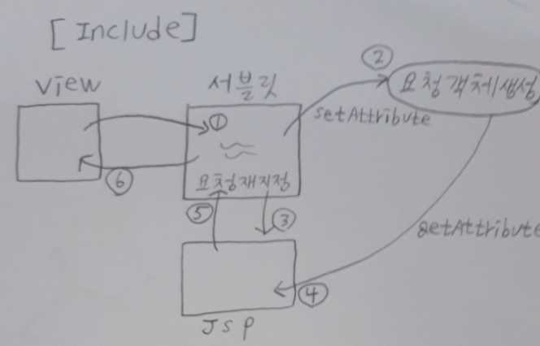

# JSP(java server page)

- 클라이언트의 요청에 대해 동적 컨텐츠를 생성해서 응답결과를 만들어 줄 때 사용하는 기술.
- 서블릿에서 발생하는 데이터를 화면에 출력하기 위해서 사용하는 기술.
- 실행될 때 WAS내부에 있는 jsp컨테이너에 의해 서블릿으로 변환되어서 실행되기 때문에 자바코드를 사용할 수 있다.
- LifeCycle이 서블릿과 비슷하다.

## JSP스크립트요소

### 스크립트릿

``` JSP
<% %>
```

- 스크립트릿 안에 자바코드를 작성할 수 있다.
- 문장의 끝에 ; 를 추가해야한다.
- 스크립트릿 요소는 여러 번 반복해서 사용가능
- 사용을 지양함.
- 서블릿이 공유하는 데이터를 꺼내서 출력하는 작업만 구현함.
- 메소드선언, 클래스선언은 못함.
- 스크립트릿 내부에서 정의하는 변수는 모두 _jspService()메소드의 지역변수로 추가된다.

### 선언문

``` jsp
<%! %>
```

- jsp파일이 서블릿으로 변환될 때 서블릿클래스의 멤버로 작성될 메소드나 변수를 정의함.

### 표현식

``` jsp
<%= %>
```

- 자바의 S.O.P와 같은 역할을 함. 내부에 ;를 추가하지 않는다.

## JSP내장객체

- 객체명은 컨테이너가 자동생성해준 이름이라서 반드시 정해진 이름으로 사용해야한다.
  - request : `HttpServletRequest`
    - 클라이언트의 요청정보를 담고 있는 객체임.
    - 서블릿으로부터 전달받아 사용한다 => 서블릿에서 사용하는 모든 것을 사용할 수 있다.
  - response : `HttpServletResponse`
  - session : `HttpSession`
  - application : `ServletContext`

## 요청재지정

- 클라이언트로부터 들어온 최초 요청을 servlet에서 원하는 다른 자원(jsp)으로 요청을 넘기는 것
- 요청재지정을 하는 목적은 서블릿에서 화면단을 분리시키고, 분리시킨 화면이 응답하도록 하기 위해 필요하다.
- 웹을 개발하기 위해 사용하는 최적화된 패턴인 MVC패턴을 적용하기 위해 반드시 필요한 개념

### 데이터 공유

1) scope

- page, request, session, application에 각각 map구조의 저장소를 갖고 있고 그 저장소에 추가하고 저장소에서 꺼내온다.
  - map구조: name과 value를 같이 저장

2) 데이터 공유하는 메소드

- 공유되는 데이터를 attribute라 한다.
- 공유할 데이터 지정은 setAttribute, 공유된 데이터를 가져오는건 getAttribute.
  - 데이터 타입 맞춰주기~!!

### 요청재지정 방법

1) sendRedirect


- 문법
  - response.sendRedirect("요청재지정될 web application의 경로")
- 실행흐름
  - 클라이언트가 서블릿 요청 -> 서블릿 실행 ->서블릿에서 요청객체 생성 -> 여기에 setAttribute -> sendRedirect를 만나서 요청재지정 호출 -> 클라이언트에게 응답 -> 클라이언트가 자동으로 다시 jsp에 요청 -> jsp에서 요청객체 생성 -> 여기서 getAttribute -> jsp가 클라이언트에게 응답
- 데이터 공유가 안된다.
  - 서블릿에서 클라이언트에게 응답할 때 만들었던 요청객체가 사라진다. 이 말은 setAttribute했던것도 같이 없어진다는 말이다. 요청재지정을 만나서 자동으로 jsp에게 클라이언트가 요청을 하면 또 자동으로 요청객체가 생성된다. 결국 jsp가 요청객체에서 getAttribute해봤자 null이 나온다. (서블릿에서 생성된것과 jsp에서 생성된 요청객체는 서로 다른 것임.)

2) forward(많이 씀)


- sendRedirect와 다르게 한 번의 요청으로 모든 web application이 실행된다. 요청재지정될 때 모든 제어를 jsp로 넘긴다.
- 문법

```서블릿&amp;JSP
RequestDispatcher rd = request.getReqeustDispatcher("요청재지정할application경로");
rd.forward(request,response);
```

- 실행흐름
  - 클라이언트가 서블릿 요청 -> 서블릿 실행 ->서블릿에서 요청객체 생성 -> 여기에 setAttribute -> 요청재지정 호출 -> jsp에서 요청객체 생성 -> 여기서 getAttribute -> jsp가 클라이언트에게 응답
- 한 번의 요청으로 모든 application이 실행되므로 데이터 공유가 가능

3) include 



- forward와 동일하게 RequestDispatcher의 메소드를 이용하여 실행하며 요청재지정될 때 모든 제어를 jsp로 넘기지 않고 다시 서블릿으로 돌아와 서블릿에서 응답된다.
- 문법

```서블릿&amp;JSP
RequestDispatcher rd =
    	request.getRequestDispatcher("요청재지정할application의 path");
rd.include(request, response);
```

- 실행흐름
  - 클라이언트가 서블릿 요청 -> 서블릿 실행 ->서블릿에서 요청객체 생성 -> 여기에 setAttribute -> 요청재지정 호출 -> jsp에서 요청객체 생성 -> 여기서 getAttribute -> jsp에서의 실행결과를 갖고 서블릿으로 되돌아옴 -> 서블릿이 클라이언트에게 응답.
- 데이터 공유 가능