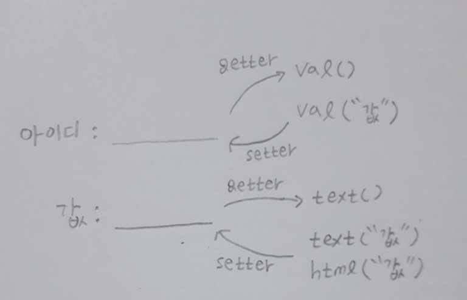

# jQuery

- javascript의 DOM을 편하게 쓰기 위한 것이 jQuery
- 선언
  - $(선택자). _________

``` jQuery
$(document).ready(function(){}); ---------------jQuery에서 윈도우가 로드될 때
아래와 위는 같은 의미임.
window.onload = finction(){}------------------- javascript에서 윈도우가 로드될 때
```

```jQuery
$(document).ready(funtion(){
	$("*").on("click",function(){
		$(".class").css("color","orange");
	});
	$("#id").click(function(){
		$("p").css("text-decoration","underline");
	});
	$("p:first").click(function(){
		$("p div").css("color","red");
	});
});
*은 모든 요소라는 뜻.
class, id, 태그 모두 선택자로 선택 가능
on("click",function(){}); 이나 click(function(){}); 이나 같은 뜻임.
p:first => p태그의 첫번째 요소라는 뜻
p div => p태그 하위의 div태그 라는 뜻.
```

``` jQuery
<선택자 추가 정리> 모두 ""와 같이 들어감.
태그:even => 태그의 짝수 (0부터 시작)
태그:odd => 태그의 홀수 (0부터 시작)
:button => button type인 것들
[속성] => ex) [href] => href속성을 갖고 있는 것들
a[target != _blank] => a태그의 target중 _blank가 아닌 것들
```

## jQuery DOM(jquery_dom_test01/02)

``` jQuery
$("선택자").append(); 			 => 선택된 노드의 lastChild node에 추가
$("선택자").prepend();			 => 선택된 노드의 firstChild node에 추가
$("선택자").after();			 => 선택된 노드 뒤에 추가
$("선택자").before();	       	 => 선택된 노드 앞에 추가
$("선택자").remove();			 => 선택된 노드와 그 하위노드를 모두 제거
$("선택자").empty();			 => 선택된 노드의 하위 노드만 제거
$("선택자").cildren(); 			 => 선택된 노드의 하위노드들(element만!!)
$("선택자").cildren().fisrt();	 => 선택된 노드의 첫번째 element
$("선택자").cildren().last();	 => 선택된 노드의 마지막 element
```

## jQuery effect(jquery_effect_test01/03)

``` jQuery
$("선택자").slideToggle;
$("선택자").animate;
```

## jQuery 추가 적인것(jquery_exam03,jquery_html_test01,jquery_ui_test01/02)

```jQuery
$("선택자").val();    => 값을 가져오는 것도 가능

$("선택자").attr();   => 선택된 노드에 속성 적용하기
여러개의 속성을 제어할 땐 Json방식으로 해야됨.
$("선택자").attr("href":"https//www.~~", "target","_blank");

$("선택자").draggable(); =>  드래그 가능
$("선택자").autocomplete({
	source: ____
}); =>  검색할 때 자동완성기능. 

```

## jQuery text(jquery_text_test01)

- text()->요소의 텍스트 반환
- html()->선택한 요소의 html태그가 포함된 컨텐츠 반환
- val()->입력필드의 값을 반환
- attr()->요소의 속성을 반환
- position()-> 요소의 위치 반환

## jQuery set/get (jquery_setget_test01)



- 위 사진에서 처럼 내가 값을 설정하면 브라우저에 띄우겠다는 말임.