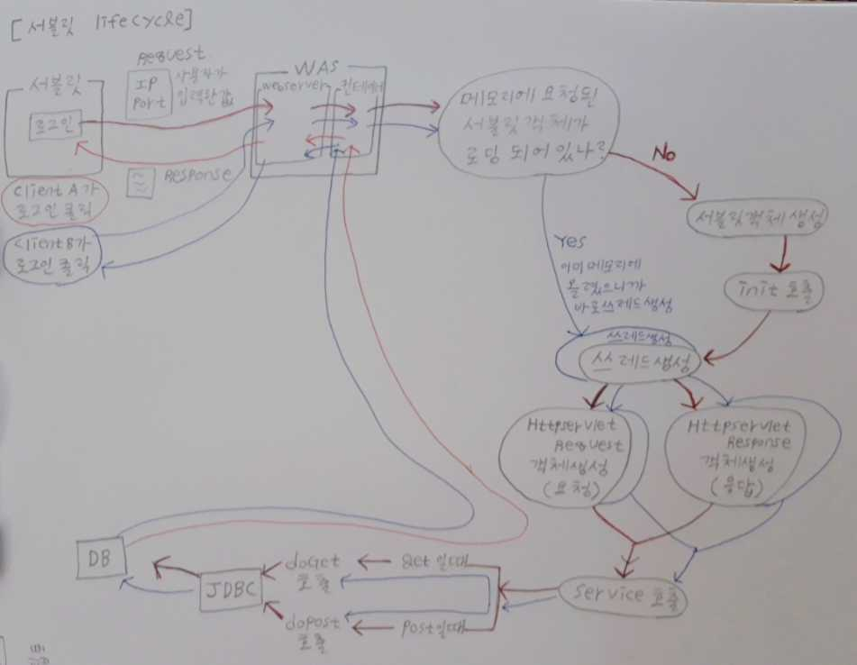

# servlet

- 서블릿은 클라이언트 페이지에서 발생하는 클라이언트에 요청을 처리하기 위한 기술
- 클라이언트로부터 요청이 전달되면 서버에서 실행되며, DB연동이나 서버의 자원을 액세스해 만들어진 결과를 클라이언트로 응답한다.
- 클라이언트의 요청을 인식하고 실행되도록 하기 위해서는 서블릿은 정해진 규칙대로 작성되어야 하고, 서버가 서블릿을 찾아서 실행할 수 있도록 `정해진 위치`(classes폴더)에 작성되어야 한다.



- 쓰레드: 하나의 프로세스 안에서 여러개의 실행 흐름이 있는 것.
- 서블릿 객체는 한번만 메모리에 올라가고 이후에는 바로 서비스가 호출됨.

## 서블릿 작성 규칙

1. 표준화된 폴더 구조 안에서 서블릿 디렉토리에 저장되어야 한다.

2. public 클래스로 작성해야 한다. => 서버가 찾아서 실행해야 하므로

3. 서블릿클래스를 상속해야 한다.

- 서버가 우리가 작성한 서블릿 클래스를 찾아서 생성하고 호출하기 위해서는 서버가 인식할 수 있는(서버가 사용할 수 있는) 타입이어야 하므로 서버에 등록된 타입으로 서블릿 클래스를 작성한다.

4. 서버가 호출하는 메소드를 오버라이딩 해야 한다.

- 서블릿이 호출되면 서버가 서블릿 객체를 생성하고 적절한 시점에 따라 메소드를 자동으로 호출한다. 즉, 서블릿의 LifeCycle을 서버가 관리한다. (lifecycle : 객체를 생성하고 소멸하는 것)

- 서버가 적절한 시점에 따라 자동으로 메소드를 호출할때 원하는 작업을 처리하기 위해서는 **서버가 호출하는 메소드를 오버라이딩해서 내가 원하는 내용을 기술해야 한다. **

  - [오버라이딩할 메소드]

    - `init `: 서블릿이 초기화될 때 호출

    - `service` : 클라이언트가 요청을 하면 호출되는 메소드 => 클라이언트의 요청을 처리할 수 있는 내용을 기술 ex.로그인, 게시판목록보기, 회원가입..

       => 요청방식의 구분없이 모두 호출

    - `doGet` : service와 동일하게 동작하며 클라이언트가 get방식으로 요청하는 경우에만 호출

    - `doPost` : service와 동일하게 동작하며 클라이언트가 post방식으로 요청하는 경우에만 호출

    - `destroy` : 서블릿 객체가 소멸될 때 (메모리에서 해제될 때) 호출

5. 서블릿 등록

- 원래는 web.xml에 등록. 근데 코드가 많이 늘어나니까 비현실적.

``` servlet
<servlet> 
  	<servlet-name>서블릿의 이름(alias)</servlet-name>
  	<servlet-class>실제사용할 서블릿클래스(패키지포함)</servlet-class>
</servlet>
 <servlet-mapping>
  	<servlet-name>미리등록한 서블릿의 이름</servlet-name>
  	<url-pattern>요청url(반드시 /나 .으로 시작</url-pattern>
</servlet-mapping>
```

- 어노테이션으로 해주자.

## 요청방식

- get (하이퍼링크는 무조건 get방식)

  : 요청할 때 입력하는 내용이 url뒤에 추가되어 전송되는 방식(요청메시지 헤더에 추가)

  - 클라이언트가 입력하는 내용이 그대로 노출된다.
  - 전송할 수 있는데이터의 크기에 제한이 있다.
  - ex) 게시판 목록 확인하기, 상품정보 가져오기, 검색하기...

- post

  : 요청메시지 body에 추가되어 전송되므로 클라이언트에 노출되지 않지만 둘을 이용하면 확인할 수 있으므로 암호화해서 전송해야 한다.

  - 보낼 수 있는데이터 크기에 제한이 없다.
  - 서버의 값을 클라이언트가 원하는 값으로 update(변경)하는 경우
  - ex) 회원등록(insert문 실행), 회원정보 수정하기(update문 실행), 파일업로드, 메일쓰기 ..

get방식으로 하고 요청하면 주소표시줄에 id값 나오고, post방식으로 하면 주소표시줄에 노출안된다.

## 요청정보 추출

1. **getParameter**

- ServletRequest의 메소드로 메소드를 호출하며 전달한 name에 대한 value를 리턴

  - 리턴값 : String으로 파라미터의 값

    > 파라미터의 값 : 주소 표시줄에 직접 넘긴 value로 = 의 오른쪽에 있는 문자열. form태그를이용해서 사용자가 직접 입력한 값

  - 매개변수 : String으로 파라미터 이름

    > 파라미터이름: 주소표시줄에 직접 넘긴 name으로 =의 왼쪽에 있는 문자열. 양식태그를 정의할 때 name속성에 정의한 값
    >
    > ~~ 파라미터명<┘

- 리턴 값과 매개변수 값은 동일하게 해주자.

1.  **getParameterValues**

- ServletRequest의 메소드로 파라미터명이 같은 모든 value를 모아서 String[]로 리턴
  - CheckBox, List에서 복수 개 선택, 임의로 동일한 이름을 정의해서 넘긴 데이터 등
  - 리턴타입 : String[ ]로 파라미터의 값들
  - 매개변수 : String으로 파라미터명을 정의
- 리턴 값과 매개변수 값은 동일하게 해주자.